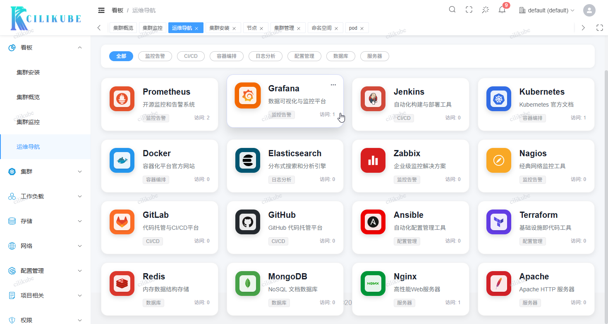

<div align="center">
  
  <h1>CiliKube</h1>
  <span>English | <a href="./README.zh-CN.md">中文</a></span>
</div>

<div align="center">
  
  
  
  
  
  
  
  
  
  
</div>

## 🌟 Project Support

We appreciate your interest in CiliKube. If you find this project valuable for your Kubernetes management needs, please consider starring the repository ⭐. Community support drives continuous development and improvement.

Stay updated with the latest releases and technical insights by following our WeChat Official Account **希里安**.

## 🤝 Contributors

<a href="https://github.com/ciliverse/cilikube/graphs/contributors">
  
</a>

We extend our gratitude to all contributors who have helped improve CiliKube through code contributions, bug reports, and feature suggestions.

## 🏢 Sponsorship

This project's CDN acceleration and security protection services are generously sponsored by Tencent EdgeOne.

<a href="https://edgeone.ai/zh?from=github">
  
</a>

## 📖 Overview

CiliKube is an enterprise-grade, open-source Kubernetes multi-cluster management platform built with modern web technologies including Vue3, TypeScript, Go, and Gin. The platform provides an intuitive, streamlined interface for comprehensive Kubernetes resource management while maintaining extensibility for custom requirements. CiliKube serves as an ideal foundation for organizations seeking efficient cluster operations and developers learning cloud-native technologies.


## ✨ Key Differentiators

CiliKube distinguishes itself from complex enterprise solutions by prioritizing simplicity and usability without sacrificing functionality:

1. **Streamlined Interface**: Provides an intuitive, clean interface for essential Kubernetes resource management operations.
2. **Developer-Centric Design**: Built with modern development practices and clean architecture, making it an excellent reference for **Vue3/Go web development** and **Kubernetes API integration**.
3. **Extensible Architecture**: Designed with modularity in mind, enabling seamless integration of custom features and workflows.

## 🎯 Target Audience

- **Frontend Developers**: Seeking hands-on experience with **Vue3 + TypeScript + Element Plus** ecosystem
- **Backend Developers**: Learning **Go + Gin** web development and microservices architecture
- **Cloud-Native Engineers**: Exploring **Kubernetes API** integration and **client-go** library implementation
- **DevOps Teams**: Requiring a lightweight, customizable Kubernetes management interface
- **Educational Institutions**: Teaching modern web development and cloud-native technologies

## 💡 Project Genesis

CiliKube emerged from a comprehensive full-stack development learning initiative, combining practical web development skills with deep Kubernetes expertise. The project represents both a technical achievement and an educational resource, designed to serve as a gateway for developers entering the cloud-native ecosystem. Our mission extends beyond providing a management tool—we aim to foster a community of learners and contributors in the open-source landscape.

## 🌐 Online Demo

- Online Demo: http://cilikubedemo.cillian.website
- Demo Credentials:
  - Username: admin
  - Password: 12345678

## 📚 Documentation

- Official Documentation: [cilikube.cillian.website](https://cilikube.cillian.website)

## 🚀 Technology Stack

CiliKube leverages industry-standard technologies and frameworks to ensure reliability, maintainability, and developer productivity.

**System Requirements**:
- Node.js >= 18.0.0 (Developed and tested with v22.14.0)
- Go >= 1.20 (Developed and tested with v1.24.2)
- PNPM >= 8.x (Package management)

**Frontend Architecture**: 
- **Core**: `Vue3` `TypeScript` `Vite` `Element Plus`
- **State Management**: `Pinia` `Vue Router`
- **HTTP Client**: `Axios`
- **Styling**: `UnoCSS` `Scss`
- **Code Quality**: `ESLint` `Prettier`
- Built upon the robust [v3-admin-vite](https://github.com/un-pany/v3-admin-vite) template by un-pany.

**Backend Architecture**: 
- **Framework**: `Go` `Gin`
- **Kubernetes Integration**: `client-go`
- **Authentication**: `JWT`
- **Real-time Communication**: `Gorilla WebSocket`
- **Configuration**: `Viper`
- **Logging**: `Zap Logger`

## ✨ Core Features

- **Enterprise Authentication**: Secure JWT-based authentication and role-based authorization
- **Comprehensive Dashboard**: Real-time cluster metrics and resource utilization overview
- **Multi-Cluster Operations**: Centralized management across multiple Kubernetes environments
- **Resource Management Suite**:
  - **Infrastructure**: Node monitoring and management
  - **Workspaces**: Namespace lifecycle management
  - **Workloads**: Complete Pod lifecycle with integrated logging and terminal access
  - **Storage**: Persistent Volume and Persistent Volume Claim administration
  - **Configuration**: Secure ConfigMap and Secret management
  - **Networking**: Service discovery and Ingress configuration
  - **Deployments**: Advanced workload management (Deployment/StatefulSet/DaemonSet)
- **User Experience**: Customizable themes and comprehensive internationalization support

## 🛠️ Development Roadmap

**Frontend**
- [x] Login Page
- [x] Basic Layout (Sidebar, Topbar, Tabs)
- [x] Notifications
- [x] Workload Resource Pages (Deployment, StatefulSet, DaemonSet, etc.)
- [x] Configuration Management Pages (ConfigMap, Secret)
- [x] Network Resource Pages (Service, Ingress)
- [x] Storage Resource Pages (StorageClass, PV, PVC)
- [x] Access Control Pages (RBAC - ServiceAccount, Role, ClusterRoleBinding, etc.)
- [x] Log Viewer Enhancements
- [x] Web Shell Terminal Integration
- [ ] Events Viewer
- [ ] Basic CRD Resource Management
- [ ] Monitoring Integration (Display data from Prometheus/Grafana)

**Backend**
- [x] Kubernetes Client Initialization
- [x] Basic Routing Setup (Gin)
- [x] CORS Configuration
- [x] JWT Authentication Middleware
- [x] WebSocket Endpoint (for Logs and Web Shell)
- [x] Multi-cluster Support
- [x] Node Resource API
- [x] Pod Resource API (List, Get, Delete, Logs, Exec)
- [x] PV/PVC Resource API
- [x] Namespace Resource API
- [x] Deployment / StatefulSet / DaemonSet Resource API
- [x] Service / Ingress Resource API
- [x] ConfigMap / Secret Resource API
- [x] RBAC Related Resource API
- [x] Event Resource API

## 💻 Local Development

### Environment Preparation
1. Install [Node.js](https://nodejs.org/) (>=18) and [pnpm](https://pnpm.io/)
2. Install [Go](https://go.dev/) (>=1.20)
3. Have a Kubernetes cluster and configure the kubeconfig file (defaults to reading `~/.kube/config`)

### Running the Frontend
```bash
# Navigate to the frontend directory
cd cilikube-web
# Install dependencies
pnpm install
# Start the development server
pnpm dev
```

Visit http://localhost:8888 to see the frontend interface.

### Running the Backend
```bash
# Navigate to the backend directory
cd cilikube
# (Optional) Update Go dependencies
go mod tidy
# Run the backend service (listens on port 8080 by default)
# Configuration files are modified in configs/config.yaml
go run cmd/server/main.go
```

### Building the Project
```bash
# Build frontend production package (output to cilikube-web/dist)
cd cilikube-web
pnpm build

# Build backend executable
cd ../cilikube
go build -o cilikube cmd/server/main.go
```

## 🐳 Docker Deployment

### Using Official Images
```bash
# Backend
docker run -d --name cilikube -p 8080:8080 -v ~/.kube:/root/.kube:ro cilliantech/cilikube:latest

# Frontend
docker run -d --name cilikube-web -p 80:80 cilliantech/cilikube-web:latest
```

### Using Docker Compose
```bash
docker-compose up -d
```

Visit http://localhost to access the interface.

## ☸️ Kubernetes Deployment (Helm)

### Environment Preparation
- Install Helm (>=3.0)
- Have a Kubernetes cluster and configure the kubeconfig file
- Install kubectl (>=1.20)

### Deployment Steps
```bash
# Add Helm repository
helm repo add cilikube https://charts.cillian.website

# Update Helm repository
helm repo update

# Install CiliKube
helm install cilikube cilikube/cilikube -n cilikube --create-namespace

# Check service status
kubectl get svc cilikube -n cilikube
```

## 🎨 Feature Preview

<details>
<summary>Click to view screenshots</summary>

<table>
  <tr>
    <td width="50%">
      
      <p align="center"><strong>Login Interface</strong></p>
    </td>
    <td width="50%">
      
      <p align="center"><strong>Dashboard Overview</strong></p>
    </td>
  </tr>
  <tr>
    <td width="50%">
      
      <p align="center"><strong>Navigation Menu</strong></p>
    </td>
    <td width="50%">
      
      <p align="center"><strong>Cluster Management</strong></p>
    </td>
  </tr>
  <tr>
    <td width="50%">
      
      <p align="center"><strong>Pod Management</strong></p>
    </td>
    <td width="50%">
      
      <p align="center"><strong>Web Terminal</strong></p>
    </td>
  </tr>
</table>

</details>

## 🤝 Contribution Guide

We welcome contributions of all forms! If you'd like to help improve CiliKube, please:

1. Fork this repository
2. Create your feature branch (`git checkout -b feature/AmazingFeature`)
3. Commit your changes (`git commit -m 'feat: Add some AmazingFeature'`) - Please follow the Git Commit Guidelines
4. Push your branch to your fork (`git push origin feature/AmazingFeature`)
5. Submit a Pull Request

### Git Commit Guidelines

Please follow the Conventional Commits specification:

- `feat`: Add new features
- `fix`: Fix issues/bugs
- `perf`: Optimize performance
- `style`: Change the code style without affecting the running result
- `refactor`: Refactor code
- `revert`: Revert changes
- `test`: Test related, does not involve changes to business code
- `docs`: Documentation and Annotation
- `chore`: Updating dependencies/modifying scaffolding configuration, etc.
- `workflow`: Workflow Improvements
- `ci`: CICD related changes
- `types`: Type definition changes
- `wip`: Work in progress (should generally not be merged)

## 📞 Contact

- Email: cilliantech@gmail.com
- Website: https://www.cillian.website
- WeChat: 希里安


## 📜 License

This project is open-sourced under the Apache 2.0 License

[](./LICENSE)
