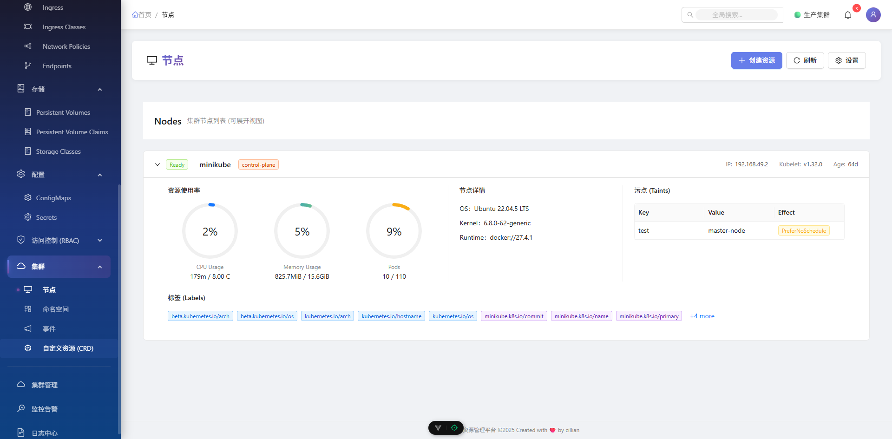
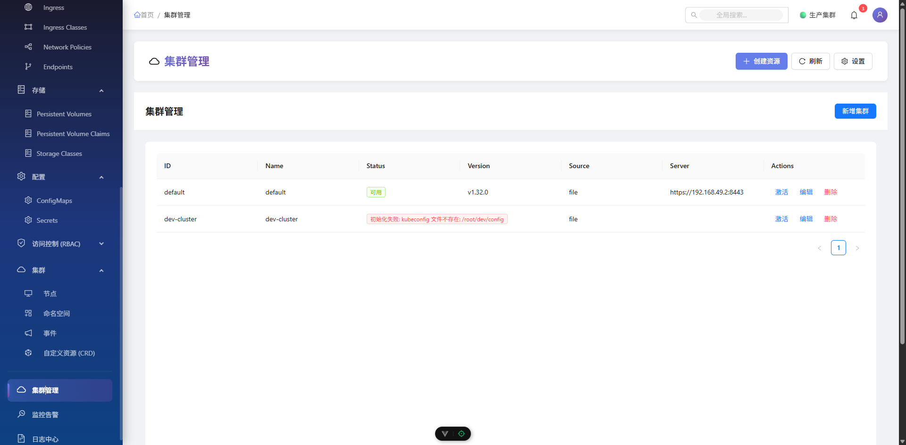

<div align="center">
  
  <h1>CiliKube</h1>
  <span>English | <a href="./README.zh-CN.md">中文</a></span>
</div>

<div align="center">
  
  
  
  
  
  
  
  
  
  
</div>

## ❤️ Support the Project

Open source is not easy. If you find CiliKube helpful or inspiring, please consider giving it a Star ⭐! Your encouragement is the primary motivation for the author to maintain and update the project regularly.

Follow the WeChat Official Account **希里安** to get the latest project updates and tech sharing!

## ❤️ Thanks To All The Contributors

<a href="https://github.com/ciliverse/cilikube/graphs/contributors">
  
</a>

Thanks to all the contributors who have contributed to CiliKube. Your efforts make this project better.

## 📝 Thanks Support

CDN acceleration and security protection for this project is sponsored by Tencent EdgeOne

[](https://edgeone.ai/zh?from=github)

## 🤔 What is CiliKube?

CiliKube is an open-source, full-stack Kubernetes multi-cluster resource management platform built with modern mainstream technology stack (Vue3, TypeScript, Go, Gin). It aims to provide a concise and elegant interface to simplify daily Kubernetes resource management (CRUD operations) while supporting feature extensions. It's an excellent choice for beginners learning k8s development.


## ✨ What Makes CiliKube Special?

Unlike complex systems pursuing "large and comprehensive" features, CiliKube focuses on being "small and beautiful." Its core goals are:

1. **Core Functionality**: Offers a clear, intuitive interface for managing common K8s resources.
2. **Learning-Friendly**: Features clean code structure and a modern tech stack, making it an excellent starting point for learning **Vue3/Go Web Development** and **custom Kubernetes tooling/development**.
3. **Easy to Extend**: Designed with extensibility in mind, allowing users to easily add custom features based on their needs.

## 🎯 Target Users

- Developers looking to learn **Vue3 + TypeScript + ElementPlus** frontend development.
- Developers looking to learn **Go + Gin** backend development.
- Cloud-native enthusiasts interested in using the **Kubernetes API** and **client-go**.
- Teams or individuals needing a concise K8s management dashboard with the potential for customization.

## 💡 Project Background

CiliKube originated from the author's practical project while learning full-stack web development. During the learning process, the author delved deep into Kubernetes and obtained relevant certifications. This project is not just a demonstration of learning outcomes but also aims to be a "Key," helping more learners like the author open the door to the open-source world, contribute, and grow together.

## 🌐 Online Demo

- Online Demo: http://cilikubedemo.cillian.website
- Demo Credentials:
  - Username: admin
  - Password: 12345678

## 📚 Documentation

- Official Documentation: [cilikube.cillian.website](https://cilikube.cillian.website)

## 🚀 Tech Stack

This project utilizes popular frontend and backend technology stacks, ensuring developers can engage with the latest tools and libraries.

**Environment Requirements (Recommended)**:
- Node.js >= 18.0.0 (Project developed with v22.14.0)
- Go >= 1.20 (Project developed with v1.24.2)
- PNPM >= 8.x

**Frontend**: `Vue3` `TypeScript` `Vite` `Element Plus` `Pinia` `Vue Router` `Axios` `UnoCSS` `Scss` `ESLint` `Prettier`
- Developed based on the excellent [v3-admin-vite](https://github.com/un-pany/v3-admin-vite) template, thanks to the original author un-pany.

**Backend**: `Go` `Gin` `Kubernetes client-go` `JWT` `Gorilla Websocket` `Viper` `Zap Logger`

## ✨ Main Features

- **User Authentication**: JWT-based login and authorization.
- **Dashboard**: Cluster resource overview.
- **Multi-Cluster Management**: Support for managing multiple Kubernetes clusters.
- **Resource Management**:
  - Node Management
  - Namespace Management
  - Pod Management (List, Details, Logs, Terminal)
  - Volume Management (PV/PVC)
  - Configuration Management (ConfigMap/Secret)
  - Network Management (Service/Ingress)
  - Workload Management (Deployment/StatefulSet/DaemonSet)
- **System Settings**: Theme switching, Internationalization (i18n) support.

## 🛠️ Development Roadmap

**Frontend**
- [x] Login Page
- [x] Basic Layout (Sidebar, Topbar, Tabs)
- [x] Notifications
- [x] Workload Resource Pages (Deployment, StatefulSet, DaemonSet, etc.)
- [x] Configuration Management Pages (ConfigMap, Secret)
- [x] Network Resource Pages (Service, Ingress)
- [x] Storage Resource Pages (StorageClass, PV, PVC)
- [x] Access Control Pages (RBAC - ServiceAccount, Role, ClusterRoleBinding, etc.)
- [x] Log Viewer Enhancements
- [x] Web Shell Terminal Integration
- [ ] Events Viewer
- [ ] Basic CRD Resource Management
- [ ] Monitoring Integration (Display data from Prometheus/Grafana)

**Backend**
- [x] Kubernetes Client Initialization
- [x] Basic Routing Setup (Gin)
- [x] CORS Configuration
- [x] JWT Authentication Middleware
- [x] WebSocket Endpoint (for Logs and Web Shell)
- [x] Multi-cluster Support
- [x] Node Resource API
- [x] Pod Resource API (List, Get, Delete, Logs, Exec)
- [x] PV/PVC Resource API
- [x] Namespace Resource API
- [x] Deployment / StatefulSet / DaemonSet Resource API
- [x] Service / Ingress Resource API
- [x] ConfigMap / Secret Resource API
- [x] RBAC Related Resource API
- [x] Event Resource API

## 💻 Local Development

### Environment Preparation
1. Install [Node.js](https://nodejs.org/) (>=18) and [pnpm](https://pnpm.io/)
2. Install [Go](https://go.dev/) (>=1.20)
3. Have a Kubernetes cluster and configure the kubeconfig file (defaults to reading `~/.kube/config`)

### Running the Frontend
```bash
# Navigate to the frontend directory
cd cilikube-web
# Install dependencies
pnpm install
# Start the development server
pnpm dev
```

Visit http://localhost:8888 to see the frontend interface.

### Running the Backend
```bash
# Navigate to the backend directory
cd cilikube
# (Optional) Update Go dependencies
go mod tidy
# Run the backend service (listens on port 8080 by default)
# Configuration files are modified in configs/config.yaml
go run cmd/server/main.go
```

### Building the Project
```bash
# Build frontend production package (output to cilikube-web/dist)
cd cilikube-web
pnpm build

# Build backend executable
cd ../cilikube
go build -o cilikube cmd/server/main.go
```

## 🐳 Docker Deployment

### Using Official Images
```bash
# Backend
docker run -d --name cilikube -p 8080:8080 -v ~/.kube:/root/.kube:ro cilliantech/cilikube:latest

# Frontend
docker run -d --name cilikube-web -p 80:80 cilliantech/cilikube-web:latest
```

### Using Docker Compose
```bash
docker-compose up -d
```

Visit http://localhost to access the interface.

## ☸️ Kubernetes Deployment (Helm)

### Environment Preparation
- Install Helm (>=3.0)
- Have a Kubernetes cluster and configure the kubeconfig file
- Install kubectl (>=1.20)

### Deployment Steps
```bash
# Add Helm repository
helm repo add cilikube https://charts.cillian.website

# Update Helm repository
helm repo update

# Install CiliKube
helm install cilikube cilikube/cilikube -n cilikube --create-namespace

# Check service status
kubectl get svc cilikube -n cilikube
```

## 🎨 Feature Preview

### New Antd-based UI (Coming Soon!)





### Current UI


## 🤝 Contribution Guide

We welcome contributions of all forms! If you'd like to help improve CiliKube, please:

1. Fork this repository
2. Create your feature branch (`git checkout -b feature/AmazingFeature`)
3. Commit your changes (`git commit -m 'feat: Add some AmazingFeature'`) - Please follow the Git Commit Guidelines
4. Push your branch to your fork (`git push origin feature/AmazingFeature`)
5. Submit a Pull Request

### Git Commit Guidelines

Please follow the Conventional Commits specification:

- `feat`: Add new features
- `fix`: Fix issues/bugs
- `perf`: Optimize performance
- `style`: Change the code style without affecting the running result
- `refactor`: Refactor code
- `revert`: Revert changes
- `test`: Test related, does not involve changes to business code
- `docs`: Documentation and Annotation
- `chore`: Updating dependencies/modifying scaffolding configuration, etc.
- `workflow`: Workflow Improvements
- `ci`: CICD related changes
- `types`: Type definition changes
- `wip`: Work in progress (should generally not be merged)

## 📞 Contact

- Email: cilliantech@gmail.com
- Website: https://www.cillian.website
- WeChat: 希里安


## 📜 License

This project is open-sourced under the Apache 2.0 License

[](./LICENSE)
