<div align="center">
  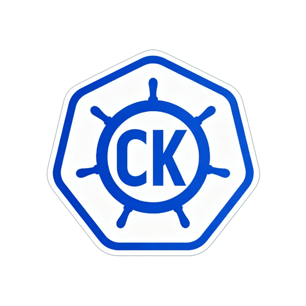
  <h1>CiliKube</h1>
  <span><a href="./README.md">English</a> | 中文</span>
</div>

<div align="center">
  
  
  
  
  
  
  
  
  
  
  
</div>

## 🌟 项目支持

感谢您对 CiliKube 的关注。如果您认为本项目对您的 Kubernetes 管理工作具有价值，请考虑为仓库点亮星标 ⭐。社区支持是推动项目持续发展和改进的重要动力。

关注微信公众号**希里安**，获取最新版本发布信息和技术洞察。

## 🤝 贡献者

<a href="https://github.com/ciliverse/cilikube/graphs/contributors">
  
</a>

我们向所有通过代码贡献、问题报告和功能建议帮助改进 CiliKube 的贡献者表示诚挚的谢意。

## 🏢 赞助支持

本项目的 CDN 加速和安全防护服务由腾讯 EdgeOne 慷慨赞助。

<a href="https://edgeone.ai/zh?from=github">
  
</a>

## 📖 产品概述

CiliKube 是一个企业级开源 Kubernetes 多集群管理平台，采用现代化 Web 技术栈构建，包括 React、TypeScript、Go 和 Gin。该平台为全面的 Kubernetes 资源管理提供直观、简化的界面，同时保持自定义需求的可扩展性。CiliKube 为寻求高效集群运维的组织和学习云原生技术的开发者提供了理想的基础平台。

### v0.8.0 React UI（当前）

<div align="center">
  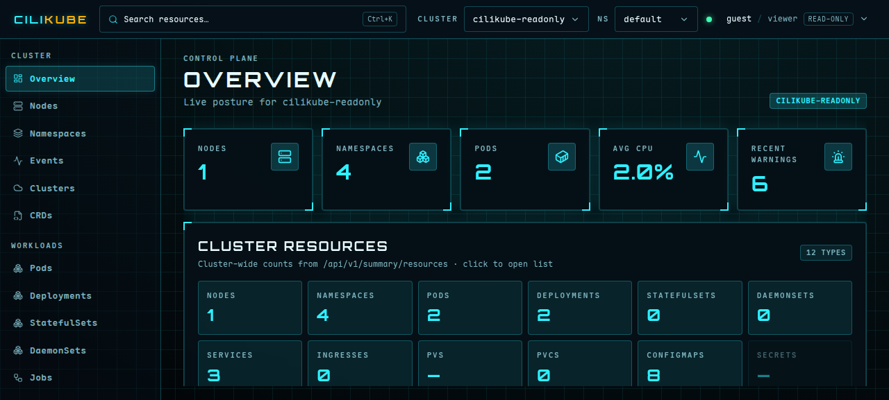
  <p><strong>集群概览</strong></p>
</div>

<div align="center">
  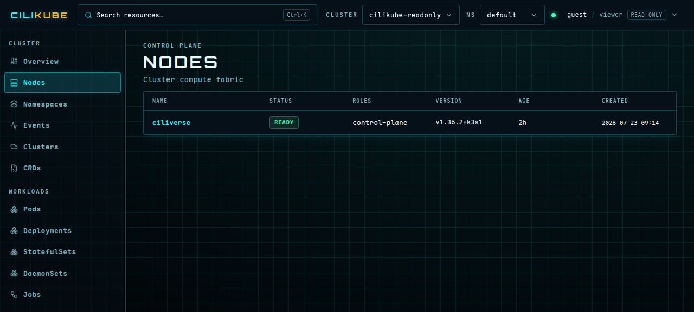
  <p><strong>节点</strong></p>
</div>

<div align="center">
  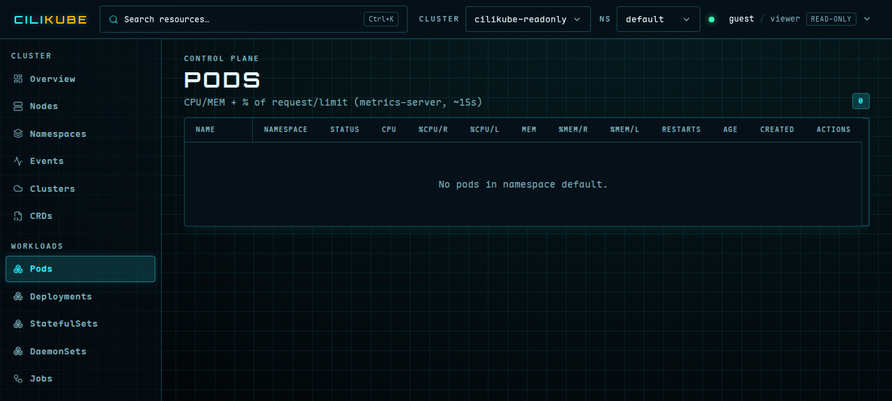
  <p><strong>Pods</strong></p>
</div>

<div align="center">
  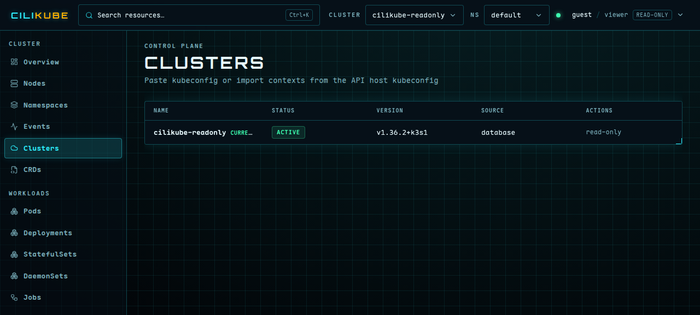
  <p><strong>集群管理</strong></p>
</div>

<div align="center">
  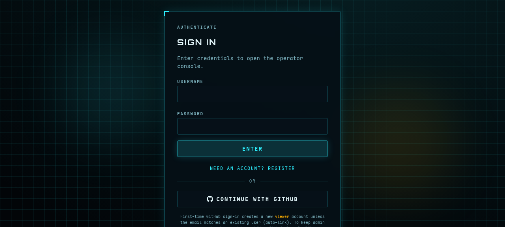
  <p><strong>登录</strong></p>
</div>

## ✨ 核心优势

CiliKube 通过专注于简洁性和可用性而非复杂的企业级解决方案，在不牺牲功能性的前提下实现了差异化：

1. **精简界面**: 为核心 Kubernetes 资源管理操作提供直观、清晰的界面
2. **开发者导向设计**: 采用现代开发实践和清晰架构构建，是学习 **React/Go Web 开发** 和 **Kubernetes API 集成** 的优秀参考
3. **可扩展架构**: 采用模块化设计，支持自定义功能和工作流的无缝集成

## 🎯 目标用户

- **前端开发者**: 寻求 **React + TypeScript + Tailwind** 生态系统实践经验
- **后端开发者**: 学习 **Go + Gin** Web 开发和微服务架构
- **云原生工程师**: 探索 **Kubernetes API** 集成和 **client-go** 库实现
- **DevOps 团队**: 需要轻量级、可定制的 Kubernetes 管理界面
- **教育机构**: 教授现代 Web 开发和云原生技术

## 💡 项目起源

CiliKube 源于一个全面的全栈开发学习计划，将实用的 Web 开发技能与深度的 Kubernetes 专业知识相结合。该项目既是技术成就的体现，也是教育资源，旨在为进入云原生生态系统的开发者提供入门途径。我们的使命不仅仅是提供管理工具，更致力于在开源领域培育学习者和贡献者社区。

## 🌐 在线预览

- 在线演示: https://cilikube.cillian.website
- 演示账号（只读 viewer）:
  - 用户名: `guest`
  - 密码: `CiliKubeGuest2026!`

## 📚 文档

- 官方文档: [cilikube.cillian.website](https://cilikube.cillian.website)

## 🚀 技术架构

CiliKube 采用行业标准技术和框架，确保可靠性、可维护性和开发者生产力。

**系统要求**:
- Node.js >= 20.0.0 (开发和测试版本 v24.14.1)
- Go >= 1.26.0 (开发和测试版本 v1.26.4)
- PNPM >= 10.x
- Kubernetes / kubectl 1.36.2（与 client-go 对齐）
- PNPM >= 8.x (包管理工具)

**前端架构**: 
- **核心技术**: `React 19` `TypeScript 7` `Vite 8` `Tailwind CSS 4`
- **数据 / 路由**: `TanStack Query` `React Router`
- **动效 / 图表**: `Framer Motion` `Recharts`
- **HTTP 客户端**: `Axios`
- 原 Vue 前端仍保留在独立仓库 [cilikube-web](https://github.com/cillianxtech/cilikube-web)。


**后端架构**: 
- **框架**: `Go` `Gin`
- **Kubernetes 集成**: `client-go`
- **身份认证**: `JWT`
- **实时通信**: `Gorilla WebSocket`
- **配置管理**: `Viper`
- **日志系统**: `Zap Logger`

## ✨ 核心功能

- **企业级身份认证**: 安全的 JWT 身份验证和基于角色的授权机制
- **综合仪表板**: 实时集群指标和资源利用率概览
- **多集群运维**: 跨多个 Kubernetes 环境的集中化管理
- **资源管理套件**:
  - **基础设施**: 节点监控和管理
  - **工作空间**: 命名空间生命周期管理
  - **工作负载**: 完整的 Pod 生命周期管理，集成日志和终端访问
  - **存储**: 持久卷和持久卷声明管理
  - **配置**: 安全的 ConfigMap 和 Secret 管理
  - **网络**: 服务发现和 Ingress 配置
  - **部署**: 高级工作负载管理 (Deployment/StatefulSet/DaemonSet)
- **用户体验**: 可定制主题和全面的国际化支持

## 🛠️ 开发计划

**前端**
- [x] 登录界面
- [x] 基础布局 (侧边栏, 顶部导航, 标签栏)
- [x] 消息通知
- [x] 工作负载资源页面 (Deployment, StatefulSet, DaemonSet 等)
- [x] 配置管理页面 (ConfigMap, Secret)
- [x] 网络资源页面 (Service, Ingress)
- [x] 存储资源页面 (StorageClass, PV, PVC)
- [x] 访问控制页面 (RBAC - ServiceAccount, Role, ClusterRoleBinding 等)
- [x] 日志查看页面优化
- [x] Web Shell 终端集成
- [ ] 事件 (Events) 查看
- [ ] CRD 资源管理 (基础)
- [ ] 监控集成 (集成 Prometheus/Grafana 数据展示)

**后端**
- [x] Kubernetes 客户端初始化
- [x] 基础路由设置 (Gin)
- [x] CORS 跨域配置
- [x] JWT 认证中间件
- [x] WebSocket 接口 (用于日志和 Web Shell)
- [x] 多集群支持
- [x] Node (节点) 资源接口
- [x] Pod 资源接口 (列表, 详情, 删除, 日志, Exec)
- [x] PV/PVC 资源接口
- [x] Namespace 资源接口
- [x] Deployment / StatefulSet / DaemonSet 资源接口
- [x] Service / Ingress 资源接口
- [x] ConfigMap / Secret 资源接口
- [x] RBAC 相关资源接口
- [x] Event 资源接口

## 💻 本地开发

### 环境准备
1. 安装 [Node.js](https://nodejs.org/) (>=18) 和 [pnpm](https://pnpm.io/)
2. 安装 [Go](https://go.dev/) (>=1.20)
3. 拥有一个 Kubernetes 集群，并配置好 kubeconfig 文件 (默认读取 `~/.kube/config`)

### 运行前端
```bash
# 进入前端目录（本仓库 monorepo 下的 web/）
cd web
# 安装依赖
pnpm install
# 启动开发服务器
pnpm dev
```

访问 http://localhost:8888 即可看到前端界面。

### 运行后端
```bash
# 在仓库根目录
# (可选) 更新 Go 依赖
go mod tidy
# 运行后端服务 (默认监听 8080 端口)
# 配置文件在 configs/config.yaml 中修改
go run cmd/server/main.go
```

### 构建项目
```bash
# 构建前端生产环境包 (输出到 web/dist)
cd web
pnpm build

# 构建后端可执行文件
cd ..
go build -o bin/cilikube cmd/server/main.go
```

## 🐳 Docker 部署

### 使用官方镜像
```bash
# 后端
docker run -d --name cilikube -p 8080:8080 -v ~/.kube:/root/.kube:ro cilliantech/cilikube:latest

# 前端
docker run -d --name cilikube-web -p 80:80 cilliantech/cilikube-web:latest
```

### 使用 Docker Compose
```bash
docker-compose up -d
```

访问 http://localhost 即可。

## ☸️ Kubernetes 部署 (Helm)

### 环境准备
- 安装 Helm (>=3.0)
- 拥有一个 Kubernetes 集群，并配置好 kubeconfig 文件
- 安装 kubectl (>=1.36.2)

### 部署步骤
```bash
# 添加 Helm 仓库
helm repo add ciliverse https://charts.cillian.website

# 更新 Helm 仓库
helm repo update

# 安装 CiliKube
helm install cilikube ciliverse/cilikube -n cilikube --create-namespace

# 查看服务状态
kubectl get svc cilikube -n cilikube
```

## 🎨 历史界面（Vue）

<details>
<summary>点击查看历史 Vue 截图</summary>

<table>
  <tr>
    <td width="50%">
      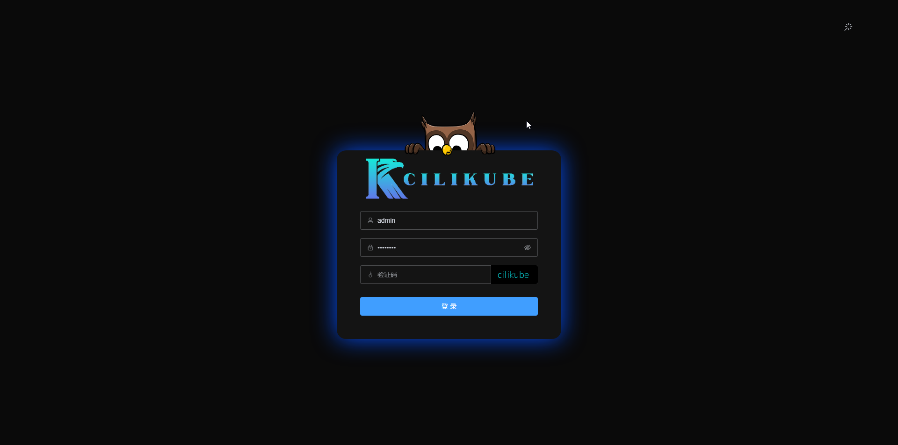
      <p align="center"><strong>登录界面</strong></p>
    </td>
    <td width="50%">
      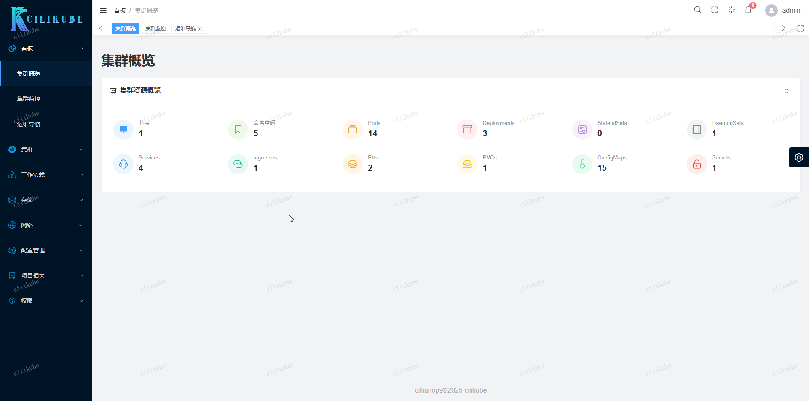
      <p align="center"><strong>仪表盘概览</strong></p>
    </td>
  </tr>
  <tr>
    <td width="50%">
      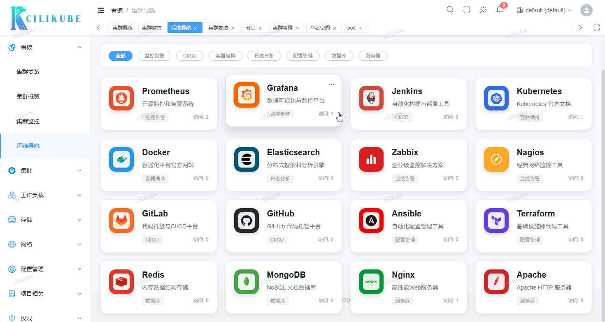
      <p align="center"><strong>导航菜单</strong></p>
    </td>
    <td width="50%">
      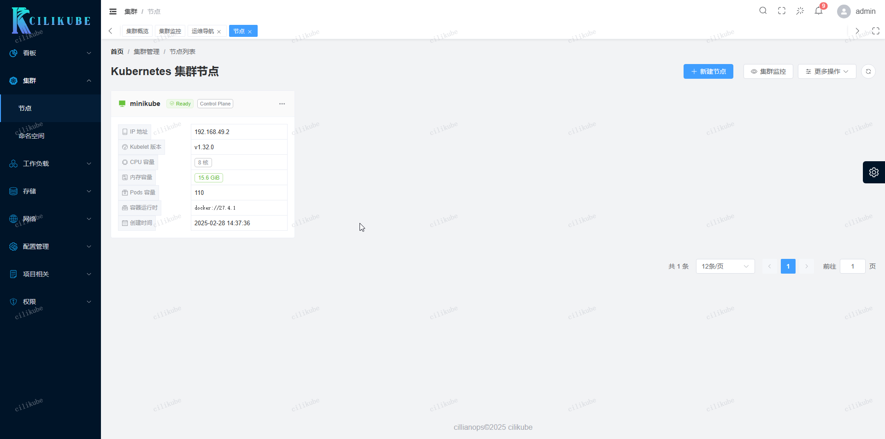
      <p align="center"><strong>集群管理</strong></p>
    </td>
  </tr>
  <tr>
    <td width="50%">
      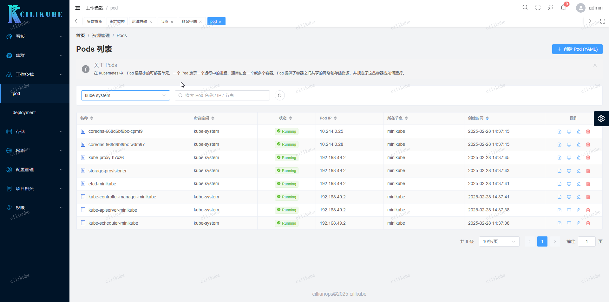
      <p align="center"><strong>Pod 管理</strong></p>
    </td>
    <td width="50%">
      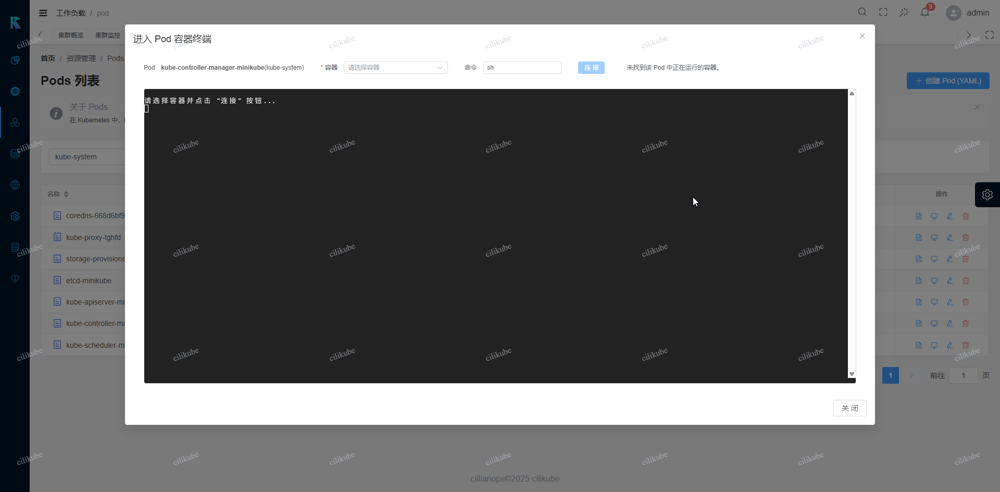
      <p align="center"><strong>Web 终端</strong></p>
    </td>
  </tr>
</table>

</details>

## 🤝 贡献指南

我们欢迎各种形式的贡献！如果您想参与改进 CiliKube，请：

1. Fork 本仓库
2. 创建您的特性分支 (`git checkout -b feature/AmazingFeature`)
3. 提交您的更改 (`git commit -m 'feat: Add some AmazingFeature'`) - 请遵循 Git 提交规范
4. 将您的分支推送到 Github (`git push origin feature/AmazingFeature`)
5. 提交 Pull Request

### Git 提交规范

请遵循 Conventional Commits 规范：

- `feat`: 新增功能
- `fix`: 修复 Bug
- `perf`: 性能优化
- `style`: 代码样式调整（不影响逻辑）
- `refactor`: 代码重构
- `revert`: 撤销更改
- `test`: 添加或修改测试
- `docs`: 文档或注释修改
- `chore`: 构建流程、依赖管理等杂项更改
- `workflow`: 工作流改进
- `ci`: CI/CD 配置相关
- `types`: 类型定义修改
- `wip`: 开发中的提交（不建议合入主分支）

## 📞 联系方式

- Email: cilliantech@gmail.com
- Website: https://www.cillian.website
- 公众号: 希里安


## 📜 许可证

本项目基于 Apache 2.0 License 开源

[](./LICENSE)
